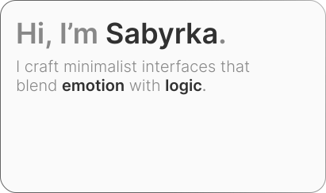
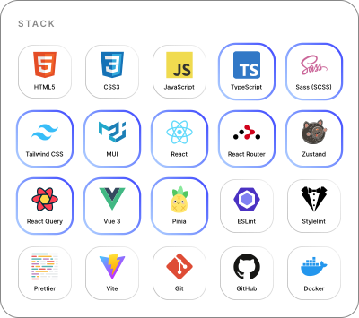

<picture>
  <source media="(prefers-color-scheme: dark)" srcset="blocks/hero/hero-dark.svg">
  <source media="(prefers-color-scheme: light)" srcset="blocks/hero/hero-light.svg">
  
</picture>

<picture>
  <source media="(prefers-color-scheme: dark)" srcset="blocks/about/about-dark.svg">
  <source media="(prefers-color-scheme: light)" srcset="blocks/about/about-light.svg">
  
</picture>

<picture>
  <source media="(prefers-color-scheme: dark)" srcset="blocks/stack/stack-dark.svg">
  <source media="(prefers-color-scheme: light)" srcset="blocks/stack/stack-light.svg">
  
</picture>

  <picture>
    <source media="(prefers-color-scheme: dark)" srcset="blocks/connect/github/github-dark.svg">
    <source media="(prefers-color-scheme: light)" srcset="blocks/connect/github/github-light.svg">
    
  </picture>
  
  <picture>
    <source media="(prefers-color-scheme: dark)" srcset="blocks/connect/telegram/telegram-dark.svg">
    <source media="(prefers-color-scheme: light)" srcset="blocks/connect/telegram/telegram-light.svg">
    
  </picture>
  
  <picture>
    <source media="(prefers-color-scheme: dark)" srcset="blocks/connect/gmail/gmail-dark.svg">
    <source media="(prefers-color-scheme: light)" srcset="blocks/connect/gmail/gmail-light.svg">
    
  </picture>

