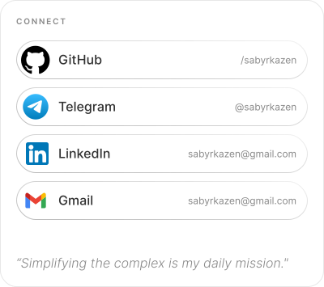

  <picture>
    <source media="(prefers-color-scheme: dark)" srcset="blocks/hero/hero-dark.svg">
    <source media="(prefers-color-scheme: light)" srcset="blocks/hero/hero-light.svg">
    
  </picture>

  <picture>
    
  </picture>

  <picture>
    <source media="(prefers-color-scheme: dark)" srcset="blocks/stack/stack-dark.svg">
    <source media="(prefers-color-scheme: light)" srcset="blocks/stack/stack-light.svg">
    
  </picture>
  
  <picture>
    <source media="(prefers-color-scheme: dark)" srcset="blocks/connect/connect-dark.svg">
    <source media="(prefers-color-scheme: light)" srcset="blocks/connect/connect-light.svg">
    
  </picture>

  <picture>
    
  </picture>

